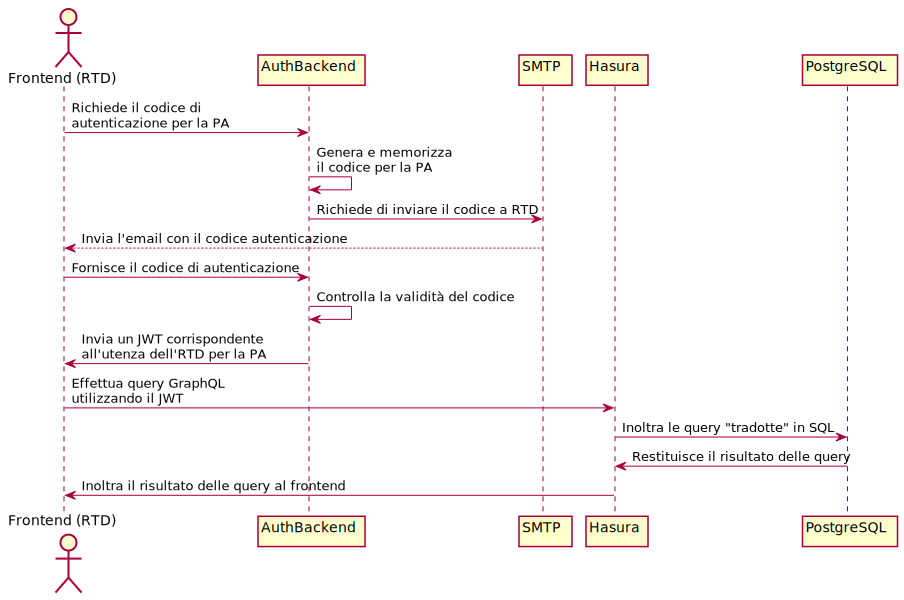

# eForm AGID

Il progetto ha l'obiettivo di implementare una piattaforma *open source* per la
raccolta di informazioni tramite form, utilizzando un modello di autenticazione
"flessibile" (es. [SPID](https://spid.gov.it), email, ...).

## Destinatari del servizio

In questa prima versione il servizio, di tipo dispositivo, è rivolto a tutte le
pubbliche amministrazioni che devono obbligatoriamente pubblicare le dichiarazioni di
accessibilità per i propri siti web e applicazioni mobile.

Tali amministrazioni utilizzano la piattaforma per compilare le dichiarazioni,
memorizzarle e riferire la pagina web ospitata su
[form.agid.gov.it](https://form.agid.gov.it) tramite un link sul proprio sito
web istituzionale.

## Autenticazione

Il servizio permette di autenticare i Responsabili per la Transizione Digitale
delle amministrazioni che ne hanno indicato l'email all'interno dell'[indice
delle pubbliche amministrazioni](https://indicepa.gov.it).

L'utente che vuole autenticarsi seleziona la propria amministrazione da un menu
a tendina e conferma di voler ricevere il codice di accesso (*password*)
all'indirizzo email dell'RTD memorizzato su [IPA](https://indicepa.gov.it).

Nel caso non esiste un indirizzo su IPA corrispondente
all'RTD dell'amministrazione selezionata, l'utente è invitato
a completare le informazioni direttamente sul sito
[indicepa.gov.it](https://indicepa.gov.it).

Nel caso invece l'indirizzo sia presente, viene inviata un'email contenente 
il codice di accesso. Si tratta di una stringa "segreta" che l'utente deve inserire
nel form di login in modo da aprire una sessione autenticata
della durata di 30 giorni; la data in cui la sessione decade è contenuta nel
campo "expire" di un JSON Web Token che l'utente (browser) riceve se il codice
inserito corrisponde a uno di quelli generati e memorizzati nel sistema.



### Dati memorizzati nel sistema

Il sistema memorizza:

- i dati (pubblici) ottenuti da IPA sulle singole amministrazioni,
  in modo da ricavare gli indirizzi degli RTD
- i dati (pubblici) immessi dall'utente durante la compilazione dei form
  (es. dichiarazione di accessibilità)

Non sono memorizzati dati privati, se non i codici di accesso autogenerati
e memorizzati in Redis, con una durata temporanea di 30gg, corrispondenti
agli account (indirizzi email) degli RTD.

## Funzionalità

L'applicazione implementa le seguenti funzionalità:

- generazione di form da file di configurazione
  [YAML](https://it.wikipedia.org/wiki/YAML)
- possibiltà di integrare facilmente logiche complesse (es. campi dipendenti dal
  valore di altri campi, valori computati, etc.)
- possibilità di memorizzare i dati senza attuare modifiche al database o al
  backend (utilizzando una base di dati **schemaless**)
- workflow: i contenuti possono assumere diversi stati (bozza, in revisione,
  pubblicato, archiviato)
- tutti i contenuti sono revisionati (viene creata una nuova revisione a ogni
  salvataggio); è possibile consultare le vecchie revisioni e compararle con
  l'ultima pubblicata
- il modello di autenticazione è flessibile: la comunicazione con il backend
  avviene tramite [json web token](https://jwt.io/)

## Tecnologie utilizzate

Il linguaggio di programmazione utilizzato è
[Typescript](https://www.typescriptlang.org/) (v3.5.x), sia per il backend
NodeJS che per il frontend ReactJS.

### Per il backend

- [NodeJS](https://nodejs.org): il backend effettua l'autenticazione e trasmette
  i JWT al frontend che li utilizza per le chiamate alle API / GraphQL
- [Apollo GraphQL](https://www.apollographql.com/): è il client utilizzato per
  l'interrogazione dei dati tramite GraphQL

### Per il frontend

- [GatsbyJS](https://www.gatsbyjs.org/): si tratta di un generatore di siti
  statici (o meglio, ibridi) che utilizza [ReactJS](https://reactjs.org) come
  linguaggio di template e [GraphQL](https://graphql.org) per l'interrogazione
  dei dati
- [Apollo GraphQL](https://www.apollographql.com/) come client per
  l'interrogazione dei dati tramite GraphQL

#### Tema GatsbyJS

Al netto delle dovute personalizzazioni, è possibile utilizzare il codice del
frontend come tema [GatsbyJS](https://www.gatsbyjs.org/) per produrre siti
"ibridi" (pagine statiche e funzionalità dinamiche tramite API) conformi ai
principi di [designers.italia.it](https://designers.italia.it).

## Componenti del sistema

La piattaforma si compone di 

1. un [backend](https://github.com/AgID/agid-forms-backend) *NodeJS*: implementa
   le funzionalità di autenticazione e generazione dei JWT da passare al
   frontend
1. un [frontend](https://github.com/AgID/agid-forms-frontend) *GatsbyJS*: i file
   "statici" (HTML) sono serviti da un'istanza del webserver
   [nginx](https://www.nginx.com)
1. dei [task
   asincroni](https://github.com/AgID/agid-forms-backend/tree/master/src/workers)
   che leggendo da una coda redis processano i job da eseguire in background
   (es. per l'invio di email)

L'infrastruttura è attualmente dispiegata su una sola macchina utilizzando i due
file [docker compose](https://docs.docker.com/compose/):

1. frontend:
   [docker-compose.yml](https://github.com/AgID/agid-forms-frontend/blob/master/docker-compose.yml)
1. backend:
   [docker-compose.yml](https://github.com/AgID/agid-forms-backend/blob/master/docker-compose.yml)

Le altre componenti consistono in

- [Hasura](https://hasura.io/): una piattaforma che realizza la pesistenza dei
  dati (GraphQL + [PostgreSQL](https://www.postgresql.org/))
- [Redis](https://redis.io/) per il caching e le code di task asincroni
- [Traefik](https://traefik.io/) come API gateway e per la generazione
  automatica dei certificati https

Il backend `NodeJS` non dialoga direttamente con il database `PostgreSQL`.
Esso effettua chiamate `GraphQL` verso la componente `Hasura` che a sua volta
le traduce in SQL da inoltrare al database.

Le uniche porte aperte esternamente (internet) sono quelle che permettono il
traffico attraverso il gateway Traefik ovvero 80 (HTTP) e 443 (HTTPS).

Gli host raggiungibili sono:

- https://form.agid.gov.it (il frontend statico)
- https://backend.form.agid.gov.it (il backend NodeJS)
- https://database.form.agid.gov.it (Hasura GraphQL)
- https://gateway.form.agid.gov.it (la dashboard Traefik)

La generazione dei certificati HTTPS avviene in automatico tramite [Let's
Encrypt](https://docs.traefik.io/user-guide/docker-and-lets-encrypt/).

## Installazione

Il dispiegamento può avvenire su una macchina Linux dove sia installato
[docker](https://docs.docker.com/install/).

Il repository del backend contiene un file
[rc.local](https://github.com/AgID/agid-forms-backend/blob/master/docker/compose/rc.local)
con i comandi che devono essere lanciati sulla macchina che ospita
l'installazione prima di avviare la piattaforma.

Si presuppone che al percorso `/data` sulla macchina *host* corrisponda una
partizione (directory) di dimensione adeguata (almeno 10GB) a ospitare i file
del layer di persistenza.

### Procedura di installazione

1. installare [git](https://git-scm.com/downloads)
1. installare [docker-compose](https://docs.docker.com/compose/install/) 
1. eseguire i seguenti comandi:

```shell
git clone https://github.com/AgID/agid-forms-backend
cp env.example .env 
# editare il file di configurazione del backend
# e impostare i valori delle variabili di configurazione.
cd agid-forms-backend && docker-compose up -d
cd ..
git clone https://github.com/AgID/agid-forms-frontend
cp env.example .env
# editare il file di configurazione del frontend
# e impostare i valori delle variabili di configurazione.
cd agid-forms-frontend && docker-compose up -d
```

## Utilizzo

Una volta lanciato docker-compose il frontend sarà raggiungibile con un browser
all'indirizzo indicato nel file di configurazione (https://form.agid.gov.it).

## Backup e ripristino

**TODO**

## Todo

- [roadmap frontend](https://www.pivotaltracker.com/n/projects/2354762)
- [roadmap backend](https://www.pivotaltracker.com/n/projects/2325271)
